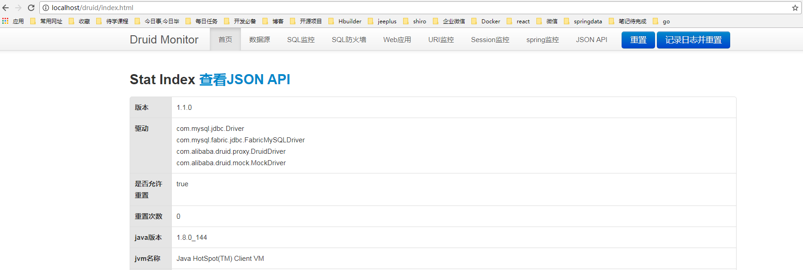
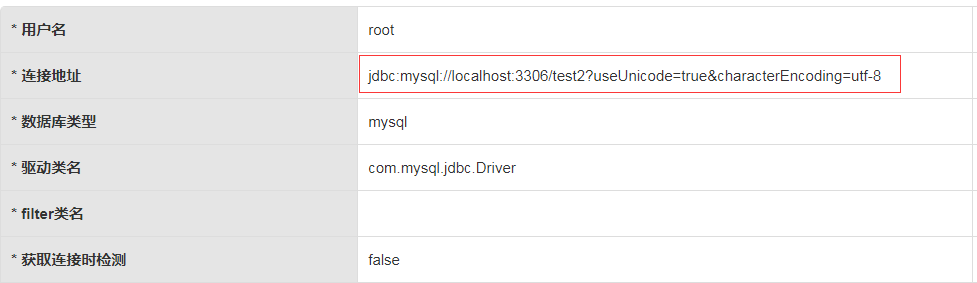

# Spring Boot 配置Mybatis 在Druid下多数据源的使用

参考: https://github.com/alibaba/druid/tree/master/druid-spring-boot-starter

## Druid 介绍

Druid 是阿里巴巴开源平台上的一个项目，整个项目由数据库连接池、插件框架和 SQL 解析器组成。该项目主要是为了扩展 JDBC 的一些限制，
可以让程序员实现一些特殊的需求，
比如向密钥服务请求凭证、统计 SQL 信息、SQL 性能收集、SQL 注入检查、SQL 翻译等，程序员可以通过定制来实现自己需要的功能。

**Druid 可以做什么**

* 替换其他 Java 连接池，Druid 提供了一个高效、功能强大、可扩展性好的数据库连接池。

* 可以监控数据库访问性能，Druid 内置提供了一个功能强大的 StatFilter 插件，能够详细统计 SQL 的执行性能，这对于线上分析数据库访问性能有帮助。

* 数据库密码加密。直接把数据库密码写在配置文件中，这是不好的行为，容易导致安全问题。DruidDruiver 和 DruidDataSource 都支持 PasswordCallback。

* SQL 执行日志，Druid 提供了不同的 LogFilter，能够支持 Common-Logging、Log4j 和 JdkLog，可以按需要选择相应的 LogFilter，监控应用的数据库访问情况。

* 扩展 JDBC，如果你要对 JDBC 层有编程的需求，可以通过 Druid 提供的 Filter 机制，很方便编写 JDBC 层的扩展插件。


Druid但数据源配置很简单,这里主要介绍下 Spring Boot 配置Mybatis 在Druid下多数据源的使用.


## 第一步: 配置文件

* 基于mybatis 的注解配置
* 多 DataSource的配置
* 为每个DataSource配置不同的Druid属性


```properties

################# mybatis注解配置  ###########################
mybatis.type-aliases-package=com.itguang.springbootmybatisdruid.entity
#################  mybatis注解配置  END #######################


################ DataSource配置  #######################

spring.datasource.driverClassName = com.mysql.jdbc.Driver
spring.datasource.url = jdbc:mysql://localhost:3306/test?useUnicode=true&characterEncoding=utf-8
spring.datasource.username = root
spring.datasource.password = root

# dataSource one
spring.datasource.druid.one.driverClassName = com.mysql.jdbc.Driver
spring.datasource.druid.one.url = jdbc:mysql://localhost:3306/test1?useUnicode=true&characterEncoding=utf-8
spring.datasource.druid.one.username = root
spring.datasource.druid.one.password = root

# dataSource two
spring.datasource.druid.two.driverClassName = com.mysql.jdbc.Driver
spring.datasource.druid.two.url = jdbc:mysql://localhost:3306/test2?useUnicode=true&characterEncoding=utf-8
spring.datasource.druid.two.username = root
spring.datasource.druid.two.password = root

################# DataSource配置 END  #######################


# 参考 :https://github.com/alibaba/druid/tree/master/druid-spring-boot-starter
################  Durid配置 #########################

# 初始化大小、最小、最大连接数
# Druid 数据源配置，继承 spring.datasource.* 配置，相同则覆盖
spring.datasource.druid.initial-size=3
spring.datasource.druid.min-idle=3
spring.datasource.druid.max-active=10

# 配置获取连接等待超时的时间
spring.datasource.druid.max-wait=60000


# Druid 数据源 1 配置，继承 spring.datasource.druid.* 配置，相同则覆盖
spring.datasource.druid.one.max-active=20
spring.datasource.druid.one.max-wait=10000

# Druid 数据源 2 配置，继承spring.datasource.druid.* 配置，相同则覆盖
spring.datasource.druid.two.max-active=30
spring.datasource.druid.two.max-wait=20000

# 监控后台账号和密码
spring.datasource.druid.stat-view-servlet.login-username=admin
spring.datasource.druid.stat-view-servlet.login-password=admin

# 配置 StatFilter
spring.datasource.druid.filter.stat.log-slow-sql=true
spring.datasource.druid.filter.stat.slow-sql-millis=2000


###############   Durid配置   END ##########################
```


## 第二步: 配置多个 Datasource

```java
/**
 * @author itguang
 * @create 2017-12-08 13:10
 **/
@Configuration
public class MultiDataSourceConfig {


    @Primary
    @Bean(name = "oneDataSource")
    @ConfigurationProperties("spring.datasource.druid.one")
    public DataSource dataSourceOne(){
        return DruidDataSourceBuilder.create().build();
    }


    @Bean(name = "twoDataSource")
    @ConfigurationProperties("spring.datasource.druid.two")
    public DataSource dataSourceTwo(){
        return DruidDataSourceBuilder.create().build();
    }


}
```

## 第三步: 配置多个 SqlSessionFactory

```java

/**
 * @author itguang
 * @create 2017-12-08 13:28
 **/
@Configuration
@MapperScan(basePackages = "com.itguang.springbootmybatisdruid.mapper.one", sqlSessionTemplateRef  = "oneSqlSessionTemplate")
public class OneDataSourceConfig {

    /**
     * 配置SqlSessionFactory
     * @param dataSource
     * @return
     * @throws Exception
     */
    @Primary
    @Bean("oneSqlSessionFactory")
    public SqlSessionFactory sqlSessionFactory(@Qualifier("oneDataSource") DataSource dataSource) throws Exception {
        SqlSessionFactoryBean factoryBean = new SqlSessionFactoryBean();
        factoryBean.setDataSource(dataSource);
        return factoryBean.getObject();

    }

    /**
     * 配置数据源1的事物管理器
     * @param dataSource
     * @return
     */
    @Primary
    @Bean("oneTransactionManager")
    public DataSourceTransactionManager dataSourceTransactionManager(@Qualifier("oneDataSource") DataSource dataSource){
        return new DataSourceTransactionManager(dataSource);

    }


    /**
     * 使用Spring的模版技术创建 SqlSessionTemplate
     * @param sqlSessionFactory
     * @return
     */
    @Primary
    @Bean("oneSqlSessionTemplate")
    public SqlSessionTemplate sqlSessionTemplate(@Qualifier("oneSqlSessionFactory") SqlSessionFactory sqlSessionFactory){
        return new SqlSessionTemplate(sqlSessionFactory);

    }

}


```

数据源二同理,可查看源码

总结一下,配置多数据源的步骤:

1. 首先创建DataSource，注入到SqlSessionFactory中.

2. 再创建事务，将SqlSessionFactory注入到创建的SqlSessionTemplate中.

3. 最后将SqlSessionTemplate注入到对应的 Mapper 包路径下。其中需要指定分库的 Mapper 包路径。

> **注意在多数据源的情况下，不需要在启动类添加：@MapperScan("com.xxx.mapper")的注解**

## 测试:


经过以上的配置多数据源就配置完成.

接下里我们启动项目,输入: http://localhost/druid (注意我的应用端口是80),进入Druid的数据源监控界面



具体使用可以去这里查看: https://github.com/alibaba/druid


我们可以像使用但数据源一样,注入Mapper,就可以进行数据库操作.

在Controller里面注入 UserMapperOne,UserMapperTwo进行测试

```java
/**
 * @author itguang
 * @create 2017-12-08 12:23
 **/
@RestController
public class HelloController {

   @Autowired
    private UserMapperOne userMapperOne;

   @Autowired
   private UserMapperTwo userMapperTwo;

   @RequestMapping("/getList")
   public void hello(){
       userMapperOne.getList();
       userMapperTwo.getList();
   }

}
```

在浏览器访问: http://localhost/getList,再去Druid的监控页面,点击数据源,就可以看到我们配置的两个数据源.





## 总结

Druid 是一款非常优秀的数据库连接池开源软件，使用 Druid 提供的druid-spring-boot-starter可以非常简单的对 Druid 进行集成。
Druid 提供了很多预置的功能，非常方便对 SQL 进行监控、分析。
在集成多数据源的时候，我们配置不同数据源，采用一层一层注入的形式，最终构建出对应的SqlSessionTemplate，
并将其注入到对应的 Mapper 包中来使用。利用 Druid 属性继承的功能，可以简化多数据源的配置，MyBatis+Druid 的多数据源解决方案很简单高效。


